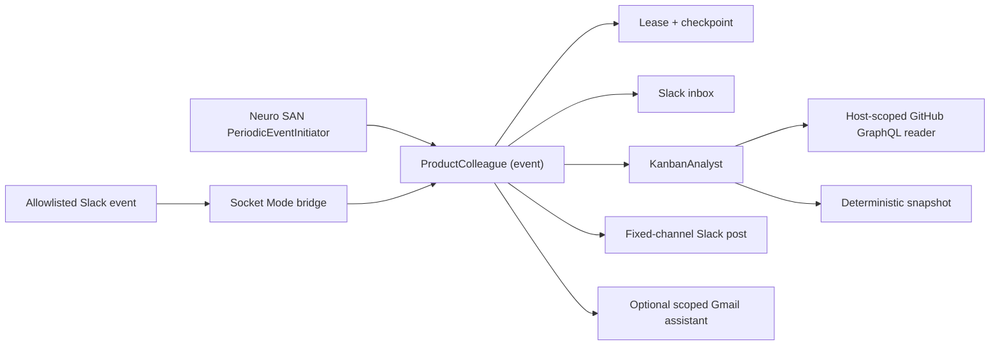

# Neuro SAN Team Colleague

A standalone Neuro SAN Studio project for an event-driven product-management
colleague. It uses neuro-san's native periodic-event runtime to inspect a GitHub
Project, notices material Kanban changes, checks trusted Slack messages, and
posts a concise update when a teammate should know. Optional Gmail tools can
search/read mail and perform tightly gated sending when explicitly requested.

The sample is deliberately useful but conservative: GitHub is read-only,
Slack has fixed channel/user allowlists, outbound Slack starts in dry-run mode,
scheduled runs take a durable overlap lease, duplicate posts are suppressed,
and audit records never contain tokens or message bodies.

## What is included

- `neuro-san-studio==0.3.9`, which pins `neuro-san==0.6.76`.
- A `ProductColleague` front agent with `function.invocation = "event"`.
- A native `manifest.hocon` periodic interaction, defaulting to every 15 minutes.
- A host-scoped, query-only GitHub Project reader whose owner/project cannot be
  selected by the model, plus read-only MCP templates for future networks.
- A deterministic Kanban snapshot/digest tool for stable change detection.
- Slack inbox and outbound tools constrained to one channel and explicit users.
- Optional Gmail search/read plus allowlisted, lease-bound sending that is off by default.
- A Socket Mode bridge that sends a body-free wake signal for an allowlisted
  Slack mention or DM; the network then reads the durable inbox itself.
- Durable state, run leasing, exact-message deduplication, and secret-free audit
  logging.
- Docker Compose deployment with one scheduler worker and persistent state.
- An optional, unserved Playwright computer-use network with observation-only
  tools.



The native scheduler discards a periodic agent's final response. That is why
the network performs its Slack/checkpoint side effects itself.

## Quick start

Requires Python 3.10 or newer.

```bash
cp .env.example .env
make setup
```

Fill in `.env`:

- `OPENAI_API_KEY`
- `GITHUB_TOKEN`
- `GITHUB_PROJECT_OWNER` and `GITHUB_PROJECT_NUMBER`
- `SLACK_BOT_TOKEN`, `SLACK_BOT_USER_ID`, `SLACK_CHANNEL_ID`, and
  `SLACK_ALLOWED_USER_IDS`
- `SLACK_APP_TOKEN` only if using the inbound Socket Mode bridge

Keep `COLLEAGUE_SLACK_WRITE_ENABLED=false` for the first run. Then validate:

```bash
make validate
```

Start only the persistent Neuro SAN server:

```bash
make run
```

In another terminal, manually exercise the same event path used by the
scheduler:

```bash
make trigger
```

Review `logs/`, `.state/colleague.json`, and `.state/audit.jsonl`. With dry-run
enabled, SlackPost returns a preview but sends nothing; its delivery gate also
keeps teammate requests pending. Once the board summary and policy look right:

```dotenv
COLLEAGUE_SLACK_WRITE_ENABLED=true
```

Restart the service after changing `.env` or the cron schedule.

## GitHub setup

The GitHub Project number is the integer in an organization or user Project
URL—not a repository number. Use a dedicated token with:

- `read:project` for Projects v2;
- `read:org` if the organization requires it;
- read-only repository access for private issue/PR details, if needed.

The sample agent does not receive raw GitHub MCP tools. Its coded reader has no
resource arguments and reads only `GITHUB_PROJECT_OWNER` plus
`GITHUB_PROJECT_NUMBER` from the host, so prompt text cannot redirect it to a
different project or repository. It uses a constant GraphQL query and returns
only bounded Kanban fields; no mutation exists.

[`mcp/mcp_info.hocon`](mcp/mcp_info.hocon) also records explicit hosted
`/projects/readonly`, `/issues/readonly`, and `/pull_requests/readonly`
endpoints for future networks. Do not attach those raw tools to an autonomous
agent without a resource-validating wrapper and a repository-limited token.

## Slack setup

Create a Slack app with a bot token and add only the scopes needed for the
chosen conversation type:

- `chat:write` for outbound updates;
- `app_mentions:read` for channel wake-ups;
- `channels:history` for a public channel, `groups:history` for a private
  channel, or `im:history` for a DM.

Invite the bot to the configured channel. Set `SLACK_CHANNEL_ID` to its stable
ID, `SLACK_BOT_USER_ID` to the bot member's stable ID, and
`SLACK_ALLOWED_USER_IDS` to a comma-separated list of people allowed to direct
the colleague. Keep `COLLEAGUE_SLACK_REQUIRE_MENTION=true` unless the selected
conversation is a dedicated DM or bot-only channel.

For inbound event wake-ups, enable Socket Mode, create an app-level token with
`connections:write`, subscribe only to `app_mention` and (if desired)
`message.im`, then run:

```bash
make slack-bridge
```

The bridge forwards a top-level Neuro SAN `ChatRequest` with a `MINIMAL` chat
filter. It never copies teammate text into that HTTP request; the network reads
it through the same paginated Slack inbox used by scheduled runs. The caller
receives an immediate event acknowledgement while the agent continues and
replies through the fixed-channel SlackPost tool.

See [Slack setup and behavior](docs/slack.md) for the complete checklist.

## Run permanently

Docker Compose keeps the service alive and mounts the colleague checkpoint on a
named volume:

```bash
docker compose --profile slack up -d --build
docker compose logs -f neuro-san slack-bridge
```

The permanent Compose deployment does not publish the Neuro SAN HTTP port to
the host. `public=false` controls discovery, not endpoint authentication. If
another system must trigger events remotely, put an authenticated TLS reverse
proxy in front of it rather than exposing the agent server directly.

Do not raise `AGENT_HTTP_SERVER_INSTANCES` above `1` and do not run multiple
server replicas for this initial deployment. Each process/replica starts its
own periodic scheduler and would otherwise duplicate work. The durable lease
is defense in depth, not a distributed scheduler.

See [operations](docs/operations.md) for schedules, recovery, observability,
and upgrade steps.

## Optional computer use

Computer use is intentionally outside the autonomous sample. API/MCP tools are
more reliable and safer for GitHub and Slack. When a future task genuinely
requires a browser, the project includes an observation-only Playwright network
that is not listed in the manifest.

For a local browser MCP server:

```bash
npx -y @playwright/mcp@0.0.77 --headless --isolated \
  --block-service-workers \
  --allowed-origins "https://github.com;https://*.githubusercontent.com" \
  --port 8931
```

It is intentionally not part of the permanent Compose stack. Run it in a
separate disposable environment with enforced network egress policy; the
Playwright origin option is defense in depth, not a security boundary.

Read [computer-use policy](docs/computer-use.md) before enabling the optional
network.

## Important runtime behavior

- Cron uses the server's local timezone.
- Missed firings during downtime are skipped; there is no catch-up queue.
- Schedule edits currently require a restart.
- The schedule interval must exceed `COLLEAGUE_MAX_RUN_SECONDS`; this sample
  keeps that value fixed at 600 to match the registry execution timeout.
- GitHub and Slack text is treated as untrusted data. Ticket content can never
  authorize actions.
- The first deployment is read-only on GitHub. Add write capabilities only as
  separate tools with narrow, deterministic approval boundaries.
- `.state/` is operational state, not source code. Back it up if notification
  continuity matters.
- A fresh Slack checkpoint looks back 24 hours by default, then drains trusted
  requests in bounded, delivery-gated batches.
- Because the network is `public=false`, `/api/v1/list` intentionally does not
  advertise it. That flag is not access control, so the Compose stack keeps the
  known endpoint internal.

## Validation performed

The project is verified against the exact released pins:

- 67 unit/contract tests;
- Ruff lint;
- `pip check`;
- the neuro-san 0.6.76 HOCON validator;
- fail-closed configuration validation;
- a real server boot showing one loaded periodic interaction,
  `EventWorkMonitor`, and `PeriodicEventInitiator`, followed by a successful
  local HTTP health request.

Live GitHub and Slack calls are not made during validation because credentials
are intentionally absent from the project.

## Project map

```text
apps/slack_bridge.py                 Slack event -> Neuro SAN event bridge
coded_tools/colleague/               state, Slack, config, and snapshot tools
config/                              shared model and plugin configuration
mcp/mcp_info.hocon                   future read-only MCP building blocks
registries/product_colleague.hocon   sample agent network
registries/manifest.hocon            native periodic schedule
registries/optional/                 disabled computer-use network
scripts/check_config.py              offline fail-closed readiness check
scripts/slack_event_admin.py         inspect/requeue/drop dead-letter events
scripts/start_server.py              validate, then exec the permanent server
scripts/trigger_event.py             manual event wake-up
tests/                               integration-boundary and contract tests
```

The rationale for replacing or hardening the pre-existing examples is captured
in [tooling decisions](docs/tooling-decisions.md), and the trust model is in
[security](docs/security.md).
