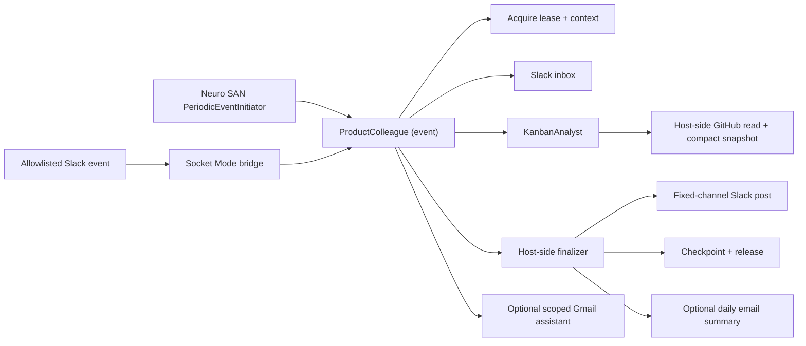

# Neuro SAN Team Colleague

A standalone Neuro SAN project for an event-driven product-management
colleague. It uses neuro-san's native periodic-event runtime to inspect a GitHub
Project, notices material Kanban changes, checks trusted Slack messages, and
posts a concise update when a teammate should know. Optional Gmail tools can
search/read mail and perform tightly gated sending when explicitly requested.

The sample is deliberately useful but conservative: GitHub is read-only,
Slack has fixed channel/user allowlists, outbound Slack starts in dry-run mode,
scheduled runs take a durable overlap lease, duplicate posts are suppressed,
and audit records never contain tokens or message bodies.

## What is included

- `neuro-san==0.6.76` core as the only Neuro SAN runtime dependency.
- A `ProductColleague` front agent with `function.invocation = "event"`.
- A side-effect-free `ProductManagerAdvisor` for PM judgment and communication
  drafts, plus a deterministic host-side finalizer for delivery and checkpoints.
- A native `manifest.hocon` periodic interaction, defaulting to every 15 minutes.
- A host-scoped GitHub Project snapshot tool whose owner/project cannot be
  selected by the model; it reads and digests the full board inside Python.
- Compact deterministic change state: aggregate counts and bounded attention
  items reach the LLM, while all cards still contribute to the digest.
- Slack inbox and outbound tools constrained to one channel and explicit users.
- Optional Gmail search/read plus allowlisted, lease-bound sending that is off by default.
- A Socket Mode bridge that sends a body-free wake signal for an allowlisted
  Slack mention or DM; the network then reads the durable inbox itself.
- Durable state, run leasing, exact-message deduplication, request-level
  at-most-once Slack replies, and secret-free audit logging.
- Fixed Slack availability notices when the service starts or is deliberately
  stopped.
- Docker Compose deployment with one scheduler worker and persistent state.
- An optional, unserved Playwright computer-use network with observation-only
  tools.



The native scheduler discards a periodic agent's final response. That is why
the network performs its Slack/checkpoint side effects itself.

## Quick start

Requires Python 3.10 or newer.

```bash
cp .env.example .env
make setup
```

Fill in `.env`:

- `OPENAI_API_KEY`
- `GITHUB_TOKEN`
- `GITHUB_PROJECT_OWNER` and `GITHUB_PROJECT_NUMBER`
- `SLACK_BOT_TOKEN`, `SLACK_BOT_USER_ID`, `SLACK_CHANNEL_ID`, and
  `SLACK_ALLOWED_USER_IDS`
- `SLACK_APP_TOKEN` only if using the inbound Socket Mode bridge

Keep `COLLEAGUE_SLACK_WRITE_ENABLED=false` for the first run. Then validate:

```bash
make validate
```

Start only the persistent Neuro SAN server:

```bash
make run
```

After validation succeeds, `make run` posts a fixed online notice when
`COLLEAGUE_SLACK_WRITE_ENABLED=true`. To receive Slack mentions immediately
instead of waiting for the next scheduled scan, also start the Socket Mode
bridge in another terminal as described under [Slack setup](#slack-setup).

In another terminal, manually exercise the same event path used by the
scheduler:

```bash
make trigger
```

Review `logs/`, `.state/colleague.json`, and `.state/audit.jsonl`. With dry-run
enabled, the finalizer records a Slack preview but sends nothing; its delivery
gate also keeps teammate requests pending. The board observation itself is
still checkpointed. Once the board summary and policy look right:

```dotenv
COLLEAGUE_SLACK_WRITE_ENABLED=true
```

Restart the service after changing `.env` or the cron schedule.

The agent decides whether an unsolicited Slack update is useful. It receives a
strong suggestion to introduce itself before its first post and another cadence
hint after 36 hours of silence by default. To enable at-most-daily email
summaries after real board changes, configure Gmail sending and set
`COLLEAGUE_DAILY_SUMMARY_TO` to a comma-separated subset of
`GMAIL_ALLOWED_RECIPIENTS`. Each recipient receives a separate message.

```dotenv
GMAIL_ALLOWED_RECIPIENTS=owner@example.com,teammate@example.com
COLLEAGUE_DAILY_SUMMARY_TO=owner@example.com,teammate@example.com
```

Every daily-summary recipient must be in the allowlist. Duplicate addresses are
removed, comparison is case-insensitive, and at most 20 recipients are
accepted.

## Periodic schedule

The default heartbeat runs every 15 minutes. To run it once per hour, set this
in `.env`:

```dotenv
COLLEAGUE_CRON_SCHEDULE="0 * * * *"
```

For an exported shell variable, quote the cron expression:

```bash
export COLLEAGUE_CRON_SCHEDULE='0 * * * *'
```

Restart the server after changing the schedule. For Compose, use `make down`
followed by `make up`; for a local foreground server, stop it with Ctrl-C and
run `make run` again. Cron uses the server's local timezone. The Socket Mode
bridge is independent of this cadence, so allowlisted Slack mentions continue
to wake the agent immediately.

## GitHub setup

The GitHub Project number is the integer in an organization or user Project
URL—not a repository number. Use a dedicated token with:

- `read:project` for Projects v2;
- `read:org` if the organization requires it;
- read-only repository access for private issue/PR details, if needed.

The sample agent does not receive raw GitHub MCP tools. Its coded snapshot tool
has no resource-selection arguments and reads only `GITHUB_PROJECT_OWNER` plus
`GITHUB_PROJECT_NUMBER` from the host, so prompt text cannot redirect it to a
different project or repository. It uses a constant GraphQL query, computes a
digest over every normalized item inside the host, and returns only aggregate
counts plus bounded attention items to the LLM; no mutation exists.

[`mcp/mcp_info.hocon`](mcp/mcp_info.hocon) also records explicit hosted
`/projects/readonly`, `/issues/readonly`, and `/pull_requests/readonly`
endpoints for future networks. Do not attach those raw tools to an autonomous
agent without a resource-validating wrapper and a repository-limited token.

## Slack setup

The bridge is optional. Without it, the periodic run still scans Slack at the
configured cron interval. With it, an allowlisted mention wakes the same agent
event path immediately.

### Configure the Slack app

Create a Slack app with a bot user. Under **OAuth & Permissions**, add only the
bot token scopes needed for the chosen conversation type:

- `chat:write` for outbound updates;
- `app_mentions:read` for channel wake-ups;
- `channels:history` for a public channel, `groups:history` for a private
  channel, or `im:history` for a DM.

Then configure event delivery:

1. Under **Socket Mode**, enable Socket Mode.
2. Under **Basic Information > App-Level Tokens**, generate a token with
   `connections:write`. This is the `xapp-...` value for
   `SLACK_APP_TOKEN`, not the bot token.
3. Under **Event Subscriptions**, enable events and add the `app_mention` bot
   event. Add `message.im` only if direct messages should wake the colleague.
   Socket Mode does not require a public Request URL.
4. Reinstall the app to the workspace after changing scopes or subscriptions.
5. Invite `@Colleague` to the configured channel.

Copy stable Slack IDs rather than display names. In Slack, **Copy link** on a
channel exposes its `C...` channel ID, while **Copy member ID** from a profile
provides a `U...` user ID. The app's bot member ID is also a `U...` value.

Configure `.env`:

```dotenv
SLACK_BOT_TOKEN=xoxb-...
SLACK_APP_TOKEN=xapp-...
SLACK_BOT_USER_ID=U...
SLACK_CHANNEL_ID=C...
SLACK_ALLOWED_USER_IDS=U123...,U456...
COLLEAGUE_SLACK_REQUIRE_MENTION=true
COLLEAGUE_SLACK_WRITE_ENABLED=true
```

`SLACK_ALLOWED_USER_IDS` is the comma-separated allowlist of teammates who
may direct the colleague. Keep mention filtering enabled unless the configured
conversation is a dedicated DM or bot-only channel.

### Run and verify the bridge

Start the validated Neuro SAN server in one terminal:

```bash
make run
```

After the server is listening on port 8080, start Socket Mode in a second
terminal:

```bash
make slack-bridge
```

The bridge should log `Starting Slack bridge for one allowlisted channel`.
Mention `@Colleague` in the configured channel from an allowlisted account.
The bridge queues body-free event metadata and wakes the server; the agent then
reads the actual message through its bounded Slack inbox and replies in the
message thread. Inspect `.state/audit.jsonl` for `slack_inbox`,
`slack_post`, and run lifecycle events if no reply appears.

The bridge forwards a top-level Neuro SAN `ChatRequest` with a `MINIMAL` chat
filter. It never copies teammate text into that HTTP request; the network reads
it through the same paginated Slack inbox used by scheduled runs. The caller
receives an immediate event acknowledgement while the agent continues and
replies through the finalizer's fixed-channel Slack boundary.

Each original Slack request can receive at most one accepted reply for 30 days,
even if a later agent run drafts different wording. This state is kept in
`.state/slack_reply_ledger.json` without message bodies.

For a planned pause, stop foreground local processes with Ctrl-C and run:

```bash
make down
```

`make down` posts a fixed offline notice and stops the Compose services.
Slack notices are best effort and do not block startup or shutdown. The next
`make run` or `make up` posts the online notice again.

See [Slack setup and behavior](docs/slack.md) for the complete checklist. Before
enabling live posting, read [first run and product-manager
tuning](docs/first-run-and-tuning.md) for expected scenarios and an initial
calibration checklist.

## Run permanently

Docker Compose keeps the service alive and mounts the colleague checkpoint on a
named volume:

```bash
make up
docker compose logs -f neuro-san slack-bridge
```

Use `make down` for a planned shutdown so Slack receives the offline notice
before Compose removes the services.

The permanent Compose deployment does not publish the Neuro SAN HTTP port to
the host. `public=false` controls discovery, not endpoint authentication. If
another system must trigger events remotely, put an authenticated TLS reverse
proxy in front of it rather than exposing the agent server directly.

Do not raise `AGENT_HTTP_SERVER_INSTANCES` above `1` and do not run multiple
server replicas for this initial deployment. Each process/replica starts its
own periodic scheduler and would otherwise duplicate work. The durable lease
is defense in depth, not a distributed scheduler.

See [operations](docs/operations.md) for schedules, recovery, observability,
and upgrade steps.

## Optional computer use

Computer use is intentionally outside the autonomous sample. API/MCP tools are
more reliable and safer for GitHub and Slack. When a future task genuinely
requires a browser, the project includes an observation-only Playwright network
that is not listed in the manifest.

For a local browser MCP server:

```bash
npx -y @playwright/mcp@0.0.77 --headless --isolated \
  --block-service-workers \
  --allowed-origins "https://github.com;https://*.githubusercontent.com" \
  --port 8931
```

It is intentionally not part of the permanent Compose stack. Run it in a
separate disposable environment with enforced network egress policy; the
Playwright origin option is defense in depth, not a security boundary.

Read [computer-use policy](docs/computer-use.md) before enabling the optional
network.

## Important runtime behavior

- Cron uses the server's local timezone.
- Missed firings during downtime are skipped; there is no catch-up queue.
- Schedule edits currently require a restart.
- The schedule interval must exceed `COLLEAGUE_MAX_RUN_SECONDS`; this sample
  keeps that value fixed at 600 to match the registry execution timeout.
- GitHub and Slack text is treated as untrusted data. Ticket content can never
  authorize actions.
- The first deployment is read-only on GitHub. Add write capabilities only as
  separate tools with narrow, deterministic approval boundaries.
- `.state/` is operational state, not source code. Back it up if notification
  continuity matters.
- A fresh Slack checkpoint looks back 24 hours by default, then drains trusted
  requests in bounded, delivery-gated batches.
- Because the network is `public=false`, `/api/v1/list` intentionally does not
  advertise it. That flag is not access control, so the Compose stack keeps the
  known endpoint internal.

## Validation performed

The project is verified against the exact released pins:

- 85 unit/contract tests;
- Ruff lint;
- `pip check`;
- the neuro-san 0.6.76 HOCON validator;
- fail-closed configuration validation;
- a real server boot showing one loaded periodic interaction,
  `EventWorkMonitor`, and `PeriodicEventInitiator`, followed by a successful
  local HTTP health request.

Live GitHub and Slack calls are not made during validation because credentials
are intentionally absent from the project.

## Project map

```text
apps/slack_bridge.py                 Slack event -> Neuro SAN event bridge
coded_tools/colleague/               state, Slack, config, and snapshot tools
config/                              shared model configuration
mcp/mcp_info.hocon                   future read-only MCP building blocks
registries/product_colleague.hocon   sample agent network
registries/manifest.hocon            native periodic schedule
registries/optional/                 disabled computer-use network
scripts/check_config.py              offline fail-closed readiness check
scripts/slack_availability.py        fixed online/offline Slack notices
scripts/slack_event_admin.py         inspect/requeue/drop dead-letter events
scripts/start_server.py              validate, then exec the permanent server
scripts/trigger_event.py             manual event wake-up
tests/                               integration-boundary and contract tests
```

The rationale for replacing or hardening the pre-existing examples is captured
in [tooling decisions](docs/tooling-decisions.md), and the trust model is in
[security](docs/security.md).
