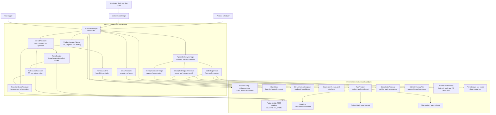

# Neuro SAN Team Colleague

A standalone Neuro SAN project for an event-driven product-management
colleague. It uses neuro-san's native periodic-event runtime to inspect a GitHub
Project, notices material Kanban changes, checks trusted Slack messages, and
posts a concise update when a teammate should know. Optional Gmail tools can
search/read mail and perform tightly gated sending when explicitly requested.

An optional downstream delivery network can propose suitable Backlog/To Do
issues in Slack, invoke the pinned `neuro-san-coder`, alternate ownership
between coder and PM through durable GitHub comments, review the resulting PR,
and request human reviewers. It is disabled by default; see
[Agentic development handoffs](docs/agentic-development.md).

The sample is deliberately useful but conservative: general GitHub research is
read-only, Slack has fixed channel/user allowlists, outbound Slack starts in dry-run mode,
scheduled runs take a durable overlap lease, duplicate posts are suppressed,
and audit records never contain tokens or message bodies. Optional delivery
writes are separately gated, repository-scoped, approval-bound, idempotent, and
provide no merge, close, delete, source-write, or formal-approval operation.

## What is included

- `neuro-san==0.6.76` core as the only Neuro SAN runtime dependency.
- A `ProductColleague` front agent with `function.invocation = "event"`.
- A side-effect-free `ProductManagerAdvisor` for PM judgment and communication
  drafts, plus a deterministic host-side finalizer for delivery and checkpoints.
- A native `manifest.hocon` periodic interaction, defaulting to every 15 minutes.
- A host-scoped GitHub Project snapshot tool whose owner/project cannot be
  selected by the model; it reads and digests the full board inside Python.
- A `GitHubAssistant` coordinator over scoped Kanban, ticket, PR, and source
  specialists backed by bounded readers for allowlisted public repositories.
- A bounded `AgenticDeliveryManager`: the top colleague supplies Kanban-aware
  product judgment, while approval and ticket-to-PR execution stay downstream.
- The existing `neuro-san-coder` pinned as a source dependency and invoked
  directly as a coded tool; every assignment starts a fresh session. A bundled
  launcher isolates its credential, permits HTTPS only, pushes to the coder's
  verified fork, and rejects coder upstream-write permissions and non-fork PRs.
- Compact deterministic change state: aggregate counts and bounded attention
  items reach the LLM, while all cards still contribute to the digest.
- Slack inbox context constrained to one channel; explicit users and mentions
  determine which messages are reply-required requests.
- Optional Gmail search/read plus allowlisted, lease-bound sending that is off by default.
- A Socket Mode bridge that sends a body-free wake signal for an allowlisted
  Slack mention or DM; the network then reads the durable inbox itself.
- Durable state, run leasing, exact-message deduplication, request-level
  at-most-once Slack replies, and secret-free audit logging.
- Optional fixed Slack availability notices when the service starts or is
  deliberately stopped, independently disabled by default.
- Docker Compose deployment with one scheduler worker and persistent state.
- An optional, unserved Playwright computer-use network with observation-only
  tools.

## Agent network schematic


```mermaid
flowchart TB
    Cron["Periodic scheduler"] --> Colleague
    Slack["Allowlisted Slack mention or DM"] --> Bridge["Socket Mode bridge"] --> Colleague
    Manual["make trigger"] --> Colleague

    subgraph Network["product_colleague agent network"]
        Colleague["ProductColleague<br/>coordinator"]
        GitHub["GitHubAssistant<br/>GitHub routing and synthesis"]
        Analyst["KanbanAnalyst<br/>board interpretation"]
        Ticket["TicketReader<br/>issue body and product context"]
        PR["PullRequestReviewer<br/>PR and patch review"]
        Code["RepositoryCodeReviewer<br/>focused source inspection"]
        Advisor["ProductManagerAdvisor<br/>PM judgment and drafting"]
        GmailAgent["GmailAssistant<br/>scoped mail tasks"]
        Delivery["AgenticDeliveryManager<br/>bounded delivery transition"]
        Triage["DeliveryCandidateTriage<br/>approval conversation"]
        Coder["CoderSupervisor<br/>fresh coder session"]
        DeliveryReview["DeliveryPullRequestReviewer<br/>review and human handoff"]

        Colleague --> GitHub
        GitHub --> Analyst
        GitHub --> Ticket
        GitHub --> PR
        GitHub --> Code
        Ticket --> PR
        PR --> Code
        Colleague --> Advisor
        Colleague --> GmailAgent
        Colleague --> Delivery
        Delivery --> Triage
        Delivery --> Coder
        Delivery --> DeliveryReview
    end

    subgraph Boundaries["Deterministic host-owned boundaries"]
        Runtime["RuntimeConfig + ColleagueState<br/>policy, lease, and context"]
        Inbox["SlackInbox<br/>bounded trusted requests"]
        Snapshot["GitHubKanbanSnapshot<br/>read-only board digest"]
        GitHubRead["Public GitHub REST readers<br/>issue, PR, tree, and file"]
        GmailTools["Gmail search, read, and gated send"]
        Finalizer["RunFinalizer<br/>delivery and checkpoint"]
        SlackPost["SlackPost<br/>fixed channel or thread"]
        DailyMail["Optional daily email fan-out"]
        State["Checkpoint + lease release"]
        Approval["SlackCoderApproval<br/>verified reply provenance"]
        DeliveryWrite["GitHubDeliveryWrite<br/>approval-bound mutations"]
        ForkGuard["CoderForkBoundary<br/>fork-only push and PR verification"]
        CodingTool["Pinned neuro-san-coder<br/>direct coded tool"]
    end

    Colleague --> Runtime
    Colleague --> Inbox
    Analyst --> Snapshot
    Ticket --> GitHubRead
    PR --> GitHubRead
    Code --> GitHubRead
    GmailAgent --> GmailTools
    Colleague --> Finalizer
    Finalizer --> SlackPost
    Finalizer --> DailyMail
    Finalizer --> State
    Triage --> Approval
    Coder --> DeliveryWrite
    Coder --> ForkGuard
    Coder --> CodingTool
    DeliveryReview --> DeliveryWrite
    DeliveryReview --> ForkGuard
```

The top coordinator delegates all GitHub work through `GitHubAssistant`, which
routes to smaller board, ticket, PR, and source specialists. Product-management
judgment and optional mail work remain separate. Credentials, resource
selection, outbound delivery, deduplication, and durable state remain in
deterministic host tools rather than model-controlled code.

The native scheduler discards a periodic agent's final response. That is why
the network performs its Slack/checkpoint side effects itself.

## Quick start

Requires Python 3.10 or newer.

```bash
git submodule update --init --recursive
cp .env.example .env
make setup
```

Fill in `.env`:

- `OPENAI_API_KEY`
- `GITHUB_TOKEN`
- `GITHUB_PROJECT_OWNER` and `GITHUB_PROJECT_NUMBER`
- `GITHUB_READ_ALLOWED_REPOSITORIES` when public repositories beyond the
  default `neuro-san` and `neuro-san-studio` pair are needed
- `SLACK_BOT_TOKEN`, `SLACK_BOT_USER_ID`, `SLACK_CHANNEL_ID`, and
  `SLACK_ALLOWED_USER_IDS`
- `SLACK_APP_TOKEN` only if using the inbound Socket Mode bridge

Agentic ticket delivery requires additional, separately scoped PM and coder
GitHub credentials. Leave it disabled during the basic first run; its complete
setup and canary are under [Agentic developer setup](#agentic-developer-setup).

Keep `COLLEAGUE_SLACK_WRITE_ENABLED=false` for the first run. Then validate:

```bash
make validate
```

Start only the persistent Neuro SAN server:

```bash
make run
```

After validation succeeds, `make run` posts a fixed online notice only when
both `COLLEAGUE_SLACK_WRITE_ENABLED=true` and
`COLLEAGUE_SLACK_AVAILABILITY_ENABLED=true`. To receive Slack mentions immediately
instead of waiting for the next scheduled scan, also start the Socket Mode
bridge in another terminal as described under [Slack setup](#slack-setup).

In another terminal, manually exercise the same event path used by the
scheduler:

```bash
make trigger
```

Review `logs/`, `.state/colleague.json`, and `.state/audit.jsonl`. With dry-run
enabled, the finalizer records a Slack preview but sends nothing; its delivery
gate also keeps teammate requests pending. The board observation itself is
still checkpointed. Once the board summary and policy look right:

```dotenv
COLLEAGUE_SLACK_WRITE_ENABLED=true
```

Restart the service after changing `.env` or the cron schedule.

## Dedicated port

All Make targets use port `8188` by default, keeping this project clear of
Neuro SAN's default port `8080`. The server, manual trigger, Slack bridge, and
Compose stack receive the same port automatically.

To use a different dedicated port for the whole shell session:

```bash
export NEURO_SAN_PM_HTTP_PORT=8288
make run
```

Then run `make trigger` and `make slack-bridge` in terminals with the same
export. For a one-off command, pass the Make variable explicitly, for example:

```bash
make NEURO_SAN_PM_HTTP_PORT=8288 run
```

Use that same override with `trigger`, `slack-bridge`, `up`, and `down`. Ports
below `1024`, above `65535`, and the reserved default `8080` are rejected by
the configuration check.

The agent decides whether an unsolicited Slack update is useful. It receives a
strong suggestion to introduce itself before its first post and another cadence
hint after 36 hours of silence by default. To enable at-most-daily email
summaries after real board changes, configure Gmail sending and set
`COLLEAGUE_DAILY_SUMMARY_TO` to a comma-separated subset of
`GMAIL_ALLOWED_RECIPIENTS`. Each recipient receives a separate message.

```dotenv
GMAIL_ALLOWED_RECIPIENTS=owner@example.com,teammate@example.com
COLLEAGUE_DAILY_SUMMARY_TO=owner@example.com,teammate@example.com
```

Every daily-summary recipient must be in the allowlist. Duplicate addresses are
removed, comparison is case-insensitive, and at most 20 recipients are
accepted.

## Gmail setup

Outbound Gmail requires both an OAuth desktop client and the Gmail API enabled
in the same Google Cloud project. Creating the OAuth JSON alone is not enough.
Google's current end-to-end reference is the
[Gmail Python quickstart](https://developers.google.com/workspace/gmail/api/quickstart/python).

1. Create or select a project in the
   [Google Cloud Console](https://console.cloud.google.com/).
2. Open the [Gmail API](https://console.cloud.google.com/apis/library/gmail.googleapis.com)
   for that project and click **Enable**.
3. In **Google Auth Platform → Branding**, configure an app name, support
   email, and developer contact email.
4. In **Google Auth Platform → Audience**, choose **Internal** for a
   Cognizant-owned project and Cognizant mailbox. Otherwise choose **External**;
   while the app is in Testing, add the mailbox that will authorize the app as
   a test user.
5. In **Google Auth Platform → Clients**, create an OAuth client with
   application type **Desktop app**, then download its JSON file.
6. Store that client JSON outside the repository:

   ```bash
   mkdir -p "$HOME/.config/neuro-san-pm"
   mv "$HOME/Downloads/client_secret_"*.json \
     "$HOME/.config/neuro-san-pm/google-oauth-client.json"
   chmod 600 "$HOME/.config/neuro-san-pm/google-oauth-client.json"
   ```

7. Authorize both Gmail reading and sending. In the browser, select the mailbox
   that the colleague should send **from**:

   ```bash
   cd /Users/m_754339/PycharmProjects/neuro-san-pm
   .venv/bin/python scripts/setup_gmail.py \
     --credentials "$HOME/.config/neuro-san-pm/google-oauth-client.json" \
     --enable-send
   ```

   This creates `.secrets/gmail-token.json`. Never commit the OAuth client JSON
   or generated token.

8. Configure the runtime:

   ```dotenv
   COLLEAGUE_GMAIL_ENABLED=true
   GMAIL_TOKEN_PATH=.secrets/gmail-token.json
   COLLEAGUE_GMAIL_WRITE_ENABLED=true
   GMAIL_ALLOWED_RECIPIENTS=owner@example.com,teammate@example.com
   COLLEAGUE_DAILY_SUMMARY_TO=owner@example.com,teammate@example.com
   ```

9. Run `make check`, then restart the server if these environment values changed.
   If Gmail returns a 403 saying the API has never been used or is disabled,
   enable the Gmail API in the exact project number named by that error and wait
   a few minutes for propagation.

An External OAuth app left in Testing issues authorizations and refresh tokens
that expire after seven days when Gmail scopes are requested. That is suitable
for a short test, but permanent operation should use an Internal Workspace app
or an appropriately published/trusted configuration. See Google's
[audience documentation](https://support.google.com/cloud/answer/15549945).

## Periodic schedule

The default heartbeat runs every 15 minutes. To run it once per hour, set this
in `.env`:

```dotenv
COLLEAGUE_CRON_SCHEDULE="0 * * * *"
```

For an exported shell variable, quote the cron expression:

```bash
export COLLEAGUE_CRON_SCHEDULE='0 * * * *'
```

Restart the server after changing the schedule. For Compose, use `make down`
followed by `make up`; for a local foreground server, stop it with Ctrl-C and
run `make run` again. Cron uses the server's local timezone. The Socket Mode
bridge is independent of this cadence, so allowlisted Slack mentions continue
to wake the agent immediately.

## GitHub setup

The GitHub Project number is the integer in an organization or user Project
URL—not a repository number. Use a dedicated token with:

- `read:project` for Projects v2;
- `read:org` if the organization requires it;
- read-only repository access for the public issue/PR/source details used here.

The sample agent does not receive raw GitHub MCP tools. Its coded snapshot tool
has no resource-selection arguments and reads only `GITHUB_PROJECT_OWNER` plus
`GITHUB_PROJECT_NUMBER` from the host, so prompt text cannot redirect it to a
different project or repository. It uses a constant GraphQL query, computes a
digest over every normalized item inside the host, and returns only aggregate
counts plus bounded attention items to the LLM; no mutation exists.

Ticket, PR, and code inspection use a separate explicit public-repository
allowlist. The defaults are:

```dotenv
GITHUB_READ_ALLOWED_REPOSITORIES=cognizant-ai-lab/neuro-san,cognizant-ai-lab/neuro-san-studio
```

Add related public repositories as comma-separated `owner/repository` names.
Every request must match this list, and the tool independently checks that
GitHub reports `private=false` before returning issue bodies, PR patches, trees,
or files. Reads are bounded: one issue or PR at a time, at most 100 changed
files, a 5,000-entry tree, and 100 KB per text file. These agents are available
for directed questions and concrete PM decisions; normal periodic board checks
do not automatically scan source repositories.

[`mcp/mcp_info.hocon`](mcp/mcp_info.hocon) also records explicit hosted
`/projects/readonly`, `/issues/readonly`, and `/pull_requests/readonly`
endpoints for future networks. Do not attach those raw tools to an autonomous
agent without a resource-validating wrapper and a repository-limited token.

## Slack setup

The bridge is optional. Without it, the periodic run still scans Slack at the
configured cron interval. With it, an allowlisted mention wakes the same agent
event path immediately.

### Configure the Slack app

Create a Slack app with a bot user. Under **OAuth & Permissions**, add only the
bot token scopes needed for the chosen conversation type:

- `chat:write` for outbound updates;
- `app_mentions:read` for channel wake-ups;
- `channels:history` for a public channel, `groups:history` for a private
  channel, or `im:history` for a DM.

Then configure event delivery:

1. Under **Socket Mode**, enable Socket Mode.
2. Under **Basic Information > App-Level Tokens**, generate a token with
   `connections:write`. This is the `xapp-...` value for
   `SLACK_APP_TOKEN`, not the bot token.
3. Under **Event Subscriptions**, enable events and add the `app_mention` bot
   event plus `message.channels` so replies in the configured public channel
   can wake the colleague without a bot mention. For a private channel, add
   `message.groups` instead. Add `message.im` only if direct messages should
   wake the colleague. Socket Mode does not require a public Request URL.
4. Reinstall the app to the workspace after changing scopes or subscriptions.
5. Invite `@Colleague` to the configured channel.

Copy stable Slack IDs rather than display names. In Slack, **Copy link** on a
channel exposes its `C...` channel ID, while **Copy member ID** from a profile
provides a `U...` user ID. The app's bot member ID is also a `U...` value.

Configure `.env`:

```dotenv
SLACK_BOT_TOKEN=xoxb-...
SLACK_APP_TOKEN=xapp-...
SLACK_BOT_USER_ID=U...
SLACK_CHANNEL_ID=C...
SLACK_ALLOWED_USER_IDS=U123...,U456...
COLLEAGUE_SLACK_REQUIRE_MENTION=true
COLLEAGUE_SLACK_WRITE_ENABLED=true
COLLEAGUE_SLACK_AVAILABILITY_ENABLED=false
```

`SLACK_ALLOWED_USER_IDS` is the comma-separated allowlist of teammates who may
direct the colleague. The periodic inbox reads all bounded human messages in
the fixed channel as ambient context, including messages from other users, but
only allowlisted messages satisfying the mention policy require replies. Keep
mention filtering enabled unless the configured conversation is a dedicated DM
or bot-only channel.

### Run and verify the bridge

Start the validated Neuro SAN server in one terminal:

```bash
make run
```

After the server is listening on this project's port 8188, start Socket Mode in
a second terminal:

```bash
make slack-bridge
```

The bridge should log `Starting Slack bridge for one allowlisted channel`.
Mention `@Colleague` in the configured channel from an allowlisted account.
The bridge queues body-free event metadata and wakes the server; the agent then
reads the actual directed message plus bounded channel context through its
Slack inbox and replies in the message thread. Ambient top-level channel
messages are picked up by periodic scans without causing immediate wake-ups or
mandatory replies. Inspect `.state/audit.jsonl` for `slack_inbox`,
`slack_post`, and run lifecycle events if no reply appears.

An ordinary reply in a Colleague thread is also a directed request and does
not need another `@Colleague` mention. It requires the matching
`message.channels` or `message.groups` subscription above; without it, Slack
does not deliver the reply to the Socket Mode bridge. Mentioning `@Colleague`
remains a reliable immediate workaround while that subscription is being added
or the app is being reinstalled.

The bridge forwards a top-level Neuro SAN `ChatRequest` with a `MINIMAL` chat
filter. It never copies teammate text into that HTTP request; the network reads
it through the same paginated Slack inbox used by scheduled runs. The caller
receives an immediate event acknowledgement while the agent continues and
replies through the finalizer's fixed-channel Slack boundary.

Each original Slack request can receive at most one accepted reply for 30 days,
even if a later agent run drafts different wording. This state is kept in
`.state/slack_reply_ledger.json` without message bodies.

For a planned pause, stop foreground local processes with Ctrl-C and run:

```bash
make down
```

`make down` stops the Compose services. When availability notices and Slack
writes are both enabled, it first posts a fixed offline notice; the next
`make run` or `make up` posts the online notice. Notices are best effort and do
not block startup or shutdown.

See [Slack setup and behavior](docs/slack.md) for the complete checklist. Before
enabling live posting, read [first run and product-manager
tuning](docs/first-run-and-tuning.md) for expected scenarios and an initial
calibration checklist.

## Agentic developer setup

Agentic delivery is optional and fail-closed. The top product colleague uses
its Kanban, Slack, issue, PR, and source context to nominate at most one ticket.
The downstream delivery manager handles approval, implementation, review, and
human handoff. GitHub comments and assignments are the durable conversation;
neither the PM nor coder can merge or formally approve a PR.

### 1. Install and verify the pinned coder

The existing `neuro-san-coder` is pinned as a Git submodule and imported as a
coded tool in this process. It does not run another Neuro SAN server.

```bash
git submodule update --init --recursive
make setup
codex --version
codex login status
gh auth status
```

### 2. Prepare separate GitHub identities and forks

Use separate automation and human identities for the safest deployment:

- A PM machine user with configured Project, issue, and PR write access.
  Upstream repository push permission is permitted for the PM credential, but
  it is never exposed to the coding subprocess.
- A coder machine user with no upstream Write permission and a same-name fork
  of each allowlisted public repository.
- One or more human reviewers, distinct from both automation identities.

The configuration checker permits the same PM/coder login and non-empty
credential for an initial trial, but warns about the reduced separation. This
only works when that credential has no upstream push permission. If the PM
account can push upstream, use a separate coder account and token: the coder
fork boundary requires that the credential exposed to Codex cannot push to the
upstream repository. PM repository push permission does not block handoff.
Confirm the identities and permissions before enabling the feature.
These commands expect the token
variables to be exported in the current shell; otherwise substitute them using
your normal secret-management workflow:

```bash
GH_TOKEN="$GITHUB_PM_TOKEN" gh api user --jq .login
GH_TOKEN="$GITHUB_CODER_TOKEN" gh api user --jq .login
GH_TOKEN="$GITHUB_PM_TOKEN" gh api repos/OWNER/REPOSITORY --jq .permissions.push
GH_TOKEN="$GITHUB_CODER_TOKEN" gh api repos/OWNER/REPOSITORY --jq .permissions.push
```

The coder upstream permission check must print `false`; the PM check may be
`true` when the PM token is a broad repository token. Create or verify the coder
fork, then confirm that it belongs to the expected upstream and is writable by
the coder:

```bash
GH_TOKEN="$GITHUB_CODER_TOKEN" gh repo fork OWNER/REPOSITORY --clone=false
GH_TOKEN="$GITHUB_CODER_TOKEN" gh api repos/CODER_LOGIN/REPOSITORY \
  --jq '{fork: .fork, parent: .parent.full_name, push: .permissions.push}'
```

Expected values are `fork: true`, `parent: OWNER/REPOSITORY`, and `push: true`.
The host checks these permissions again before every coding session. It rewrites
the local `origin` to the coder fork, sets `upstream` to the allowlisted source,
and rejects PRs that do not go from that fork into the upstream default branch.

If a ticket reports `Coder must not have upstream push permission`, the
configured `GITHUB_CODER_TOKEN` belongs to an account that can push to the
upstream repository. Check both identities and tokens explicitly:

```bash
GH_TOKEN="$GITHUB_PM_TOKEN" gh api repos/OWNER/REPOSITORY --jq .permissions.push
GH_TOKEN="$GITHUB_CODER_TOKEN" gh api repos/OWNER/REPOSITORY --jq .permissions.push
```

The second value must be `false`. Create or use a dedicated coder account,
fork the repository into that account, and set both
`GITHUB_CODER_TOKEN` and `GITHUB_DELIVERY_CODER_LOGIN` to that account. After
fixing the environment, the blocked ticket can be retried; no new canary is
needed when no coding run or PR was started.

### 3. Configure the GitHub Project

Get the Project node ID, Status field ID, and the option IDs for `In Progress`
and `In Review`:

```bash
gh project view "$GITHUB_PROJECT_NUMBER" \
  --owner "$GITHUB_PROJECT_OWNER" --format json
gh project field-list "$GITHUB_PROJECT_NUMBER" \
  --owner "$GITHUB_PROJECT_OWNER" --format json
```

### 4. Configure the delivery boundary

Keep the three write/feature switches false while filling in `.env`:

```dotenv
COLLEAGUE_AGENTIC_DEVELOPMENT_ENABLED=false
GITHUB_DELIVERY_WRITE_ENABLED=false
COLLEAGUE_SLACK_WRITE_ENABLED=false

AGENTIC_DELIVERY_ELIGIBLE_STATUSES=Backlog,To Do
AGENTIC_DELIVERY_STALE_AFTER_DAYS=14
AGENTIC_DELIVERY_APPROVAL_TTL_SECONDS=259200
AGENTIC_DELIVERY_REQUIRED_LABEL=pm-agentic-e2e

GITHUB_DELIVERY_ALLOWED_REPOSITORIES=OWNER/REPOSITORY
GITHUB_PM_TOKEN=<pm-machine-user-token>
GITHUB_CODER_TOKEN=<coder-machine-user-token>
GITHUB_DELIVERY_PM_LOGIN=<pm-machine-user-login>
GITHUB_DELIVERY_CODER_LOGIN=<coder-machine-user-login>
GITHUB_DELIVERY_HUMAN_REVIEWERS=<human-login-1>,<human-login-2>

GITHUB_PROJECT_ID=<project-node-id>
GITHUB_PROJECT_STATUS_FIELD_ID=<status-field-node-id>
GITHUB_PROJECT_STATUS_OPTIONS_JSON={"In Progress":"<option-id>","In Review":"<option-id>"}

CODING_AGENT_ALLOWED_WORKSPACES=/absolute/allowed/root
CODING_AGENT_PRIMARY_WORKSPACE=/absolute/allowed/root/repository
CODING_AGENT_CODEX_EXECUTABLE=scripts/coder_codex_launcher.py
CODING_AGENT_REAL_CODEX_EXECUTABLE=codex
CODING_AGENT_GIT_NAME=neuro-san coder
CODING_AGENT_GIT_EMAIL=<coder-commit-email>
CODING_AGENT_CODEX_SANDBOX=workspace-write
CODING_AGENT_TIMEOUT_SECONDS=480
```

`CODING_AGENT_PRIMARY_WORKSPACE` must be an existing Git clone inside an
allowed root and must correspond to the configured upstream or coder fork. On
macOS, separate multiple allowed roots with `:`. Keep the coder timeout at 480
seconds or lower so the 600-second outer PM run retains time to persist the
handoff.

The bundled launcher removes ambient human and PM credentials, disables SSH
and global/system credential helpers, and gives Codex only the coder credential
for non-interactive HTTPS access to its fork. Do not replace
`CODING_AGENT_CODEX_EXECUTABLE` with `codex` directly.

### 5. Run offline verification

```bash
make check
make agentic-test
```

The feature remains disabled at this point, so no external write is performed.

### 6. Create a disposable canary issue

Create a fresh, disposable, small documentation- or test-only issue in an
allowlisted upstream repository. Give it explicit acceptance criteria and the
`pm-agentic-e2e` label. Add it to the configured Project in `Backlog` or
`To Do`, leave it unassigned, and ensure no other issue has that label. Use a
new canary ticket after a blocked or failed attempt so stale approval and
handoff state cannot affect the verification.

### 7. Enable the live canary

Change only these gates:

```dotenv
COLLEAGUE_SLACK_WRITE_ENABLED=true
COLLEAGUE_AGENTIC_DEVELOPMENT_ENABLED=true
GITHUB_DELIVERY_WRITE_ENABLED=true
```

Then verify the complete enabled configuration:

```bash
make check
```

### 8. Run the canary

Start the server:

```bash
make run
```

The Socket Mode bridge is useful for normal directed Slack messages, but the
manual trigger gives the canary a deterministic cadence. In another terminal:

```bash
make trigger
```

Confirm that exactly one Slack proposal appears and that GitHub has not changed
before approval. Reply naturally in that proposal thread—for example, “looks
good; have the coder take it.” With the Slack bridge running, the thread
reply itself wakes the next run; `make trigger` is only a deterministic fallback.
The triage agent interprets the response as approval, rejection, or unclear. The host then re-fetches the exact Slack
message and independently verifies its channel, thread, timestamp, unexpired
proposal, and allowlisted human author. If the reply is ambiguous, the agent
asks one deduplicated clarification in the same thread.

Wait for the bridge-driven run to start. If the bridge is not running, invoke
one fallback cycle with `make trigger`. Wait for each run to finish; a coding
run may take up to eight minutes. Expected progression:

1. An agentic developer plan is posted on the issue.
2. The card moves to `In Progress` and the issue is assigned to the coder.
3. The coder creates a branch on its fork and opens a cross-fork PR.
4. Implementation and test evidence are recorded on the issue.
5. The issue and PR return to the PM for review.
6. Review findings and revision handoffs remain in GitHub, not Slack.
7. When satisfactory, the card moves to `In Review` and human reviewers are
   requested.

The canary passes only when the PR remains open and unmerged, targets the
allowlisted upstream default branch from the verified coder fork, and has the
configured human review request. Check it directly:

```bash
gh pr view PR_URL --json state,mergedAt,headRepositoryOwner,baseRefName,reviewRequests,url
```

`state` must be `OPEN` and `mergedAt` must be `null`. The PM and coder tools do
not expose merge, close, delete, source-write-to-upstream, or formal PR approval
operations.

Issue and PR text is untrusted input. Context passed to agents and outbound
GitHub comments is bounded and redacts local filesystem paths and common
credential/token formats. Do not put secrets in tickets or comments.

### 9. Disable or expand after the canary

Restore any of these kill switches to `false` to stop delivery immediately:

```dotenv
COLLEAGUE_AGENTIC_DEVELOPMENT_ENABLED=false
GITHUB_DELIVERY_WRITE_ENABLED=false
COLLEAGUE_SLACK_WRITE_ENABLED=false
```

After a successful canary, remove `AGENTIC_DELIVERY_REQUIRED_LABEL` to allow
normal eligible Backlog and To Do tickets. Keep it set whenever you want the PM
restricted to explicitly labeled test issues. The full workflow and recovery
notes are also in [Agentic development handoffs](docs/agentic-development.md).

## Run permanently

Docker Compose keeps the service alive and mounts the colleague checkpoint on a
named volume:

```bash
make up
docker compose logs -f neuro-san slack-bridge
```

Use `make down` for a planned shutdown. Slack receives the offline notice before
Compose removes the services only when availability notices are enabled.

The permanent Compose deployment does not publish the Neuro SAN HTTP port to
the host. `public=false` controls discovery, not endpoint authentication. If
another system must trigger events remotely, put an authenticated TLS reverse
proxy in front of it rather than exposing the agent server directly.

Do not raise `AGENT_HTTP_SERVER_INSTANCES` above `1` and do not run multiple
server replicas for this initial deployment. Each process/replica starts its
own periodic scheduler and would otherwise duplicate work. The durable lease
is defense in depth, not a distributed scheduler.

See [operations](docs/operations.md) for schedules, recovery, observability,
and upgrade steps.

## Optional computer use

Computer use is intentionally outside the autonomous sample. API/MCP tools are
more reliable and safer for GitHub and Slack. When a future task genuinely
requires a browser, the project includes an observation-only Playwright network
that is not listed in the manifest.

For a local browser MCP server:

```bash
npx -y @playwright/mcp@0.0.77 --headless --isolated \
  --block-service-workers \
  --allowed-origins "https://github.com;https://*.githubusercontent.com" \
  --port 8931
```

It is intentionally not part of the permanent Compose stack. Run it in a
separate disposable environment with enforced network egress policy; the
Playwright origin option is defense in depth, not a security boundary.

Read [computer-use policy](docs/computer-use.md) before enabling the optional
network.

## Important runtime behavior

- The Makefile keeps this project off Neuro SAN's default port 8080. It exports
  port 8188 consistently to the server, trigger client, Slack bridge, and
  Compose stack. To choose another dedicated port for one invocation, use
  `make NEURO_SAN_PM_HTTP_PORT=8288 run` (and use the same override for
  `trigger`, `slack-bridge`, `up`, and `down`).
- Cron uses the server's local timezone.
- Missed firings during downtime are skipped; there is no catch-up queue.
- Schedule edits currently require a restart.
- The schedule interval must exceed `COLLEAGUE_MAX_RUN_SECONDS`; this sample
  keeps that value fixed at 600 to match the registry execution timeout.
- GitHub and Slack text is treated as untrusted data. Ticket content can never
  authorize actions.
- General GitHub research remains read-only. Optional delivery mutations use
  separate repository-scoped, approval-bound tools and are disabled by default.
- `.state/` is operational state, not source code. Back it up if notification
  continuity matters.
- A fresh Slack checkpoint looks back 24 hours by default, then drains trusted
  requests in bounded, delivery-gated batches.
- Because the network is `public=false`, `/api/v1/list` intentionally does not
  advertise it. That flag is not access control, so the Compose stack keeps the
  known endpoint internal.

## Validation performed

The project is verified against the exact released pins:

- the complete unit/contract suite, including simulated Slack approval,
  fork-boundary, GitHub-delivery, and network-topology tests;
- Ruff lint;
- `pip check`;
- the neuro-san 0.6.76 HOCON validator;
- fail-closed configuration validation;
- a real server boot showing one loaded periodic interaction,
  `EventWorkMonitor`, and `PeriodicEventInitiator`, followed by a successful
  local HTTP health request.

Live GitHub and Slack calls are not made during validation because credentials
are intentionally absent from the project.

## Project map

```text
apps/slack_bridge.py                 Slack event -> Neuro SAN event bridge
coded_tools/colleague/               state, Slack, GitHub readers, delivery, and fork boundaries
config/                              shared model configuration
mcp/mcp_info.hocon                   future read-only MCP building blocks
registries/product_colleague.hocon   sample agent network
registries/manifest.hocon            native periodic schedule
registries/optional/                 disabled computer-use network
scripts/check_config.py              offline fail-closed readiness check
scripts/coder_codex_launcher.py      fork-only Codex credential boundary
scripts/github_coder_askpass.py      non-interactive coder HTTPS credentials
scripts/slack_availability.py        fixed online/offline Slack notices
scripts/slack_event_admin.py         inspect/requeue/drop dead-letter events
scripts/start_server.py              validate, then exec the permanent server
scripts/trigger_event.py             manual event wake-up
vendor/neuro-san-coder/              pinned existing coder coded tool
tests/                               integration-boundary and contract tests
```

The rationale for replacing or hardening the pre-existing examples is captured
in [tooling decisions](docs/tooling-decisions.md), and the trust model is in
[security](docs/security.md).
